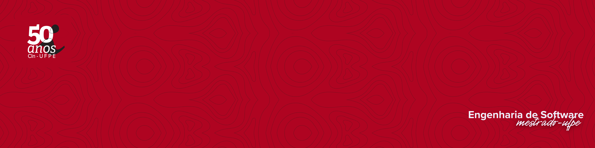

# Demonstração: O Impacto da Dívida Técnica (Client/Server)


Este é um mini-projeto em Node.js criado para demonstrar de forma prática o conceito de **Dívida Técnica Auto-Admitida (SATD)** em um cenário client/server.

## Conceitos-Chave

### Dívida Técnica (Technical Debt)
É uma metáfora criada por Ward Cunningham que descreve a consequência de escolher uma solução de código fácil e rápida ("código viável") em vez de uma solução melhor que levaria mais tempo. Ao fazer isso, "contraímos uma dívida" que precisará ser paga no futuro com juros, na forma de maior custo de manutenção, mais bugs e menor velocidade para adicionar novas funcionalidades.

### Dívida Técnica Auto-Admitida (SATD)
É um subconjunto da Dívida Técnica que é **explicitamente documentado** pelo próprio desenvolvedor dentro do código-fonte. Geralmente, isso é feito através de comentários como `// TODO`, `// FIXME` ou `// XXX`. Este projeto foca na SATD porque ela é um indicador visível e mensurável da dívida em um sistema.

## A Ideia do Projeto

O objetivo é simular uma API (`server.js`) que possui dívidas técnicas conhecidas e um cliente (`client.js`) que consome essa API. Através da interação entre eles, podemos observar o impacto real e os riscos de não "pagar" a dívida.

### O Cenário

* **`server.js`**: Uma API simples com um endpoint (`POST /users`) para cadastrar novos usuários. O servidor contém duas dívidas técnicas documentadas:
    1.  **`FIXME`**: A validação dos dados do usuário é muito fraca e representa um risco.
    2.  **`TODO`**: A funcionalidade de enviar um e-mail de boas-vindas está ausente.

* **`client.js`**: Um script que simula um consumidor da API. Ele tenta cadastrar dois usuários:
    1.  Um usuário **inválido**, com dados que deveriam ser rejeitados.
    2.  Um usuário **válido**.

## Como Rodar a Demonstração

Você precisará de dois terminais abertos na pasta do projeto.

1.  **Terminal 1: Inicie o Servidor**
    ```bash
    yarn start:server
    ```
    O servidor ficará ativo, esperando por requisições.

2.  **Terminal 2: Execute o Cliente**
    ```bash
    yarn start:client
    ```

## Observando o Impacto da Dívida

Ao executar o cliente, observe o output no terminal. Você notará que o **servidor aceitou e "criou" o usuário inválido** (respondendo com `status: 201`).

Este é o **impacto visível da dívida técnica**: o sistema se comporta de maneira incorreta e insegura, exatamente como alertado no comentário `FIXME` que foi ignorado para cumprir um prazo.

Para uma demonstração completa, um segundo commit poderia ser feito com a dívida paga no `server.js`. Ao rodar o mesmo cliente novamente, o primeiro teste agora falharia com um erro `status: 400`, demonstrando o comportamento correto após a refatoração.

<br>
<div style="text-align: center; font-family: monospace; white-space: pre;">
  <a href="https://git.io/typing-svg">
    
  </a>
</div>